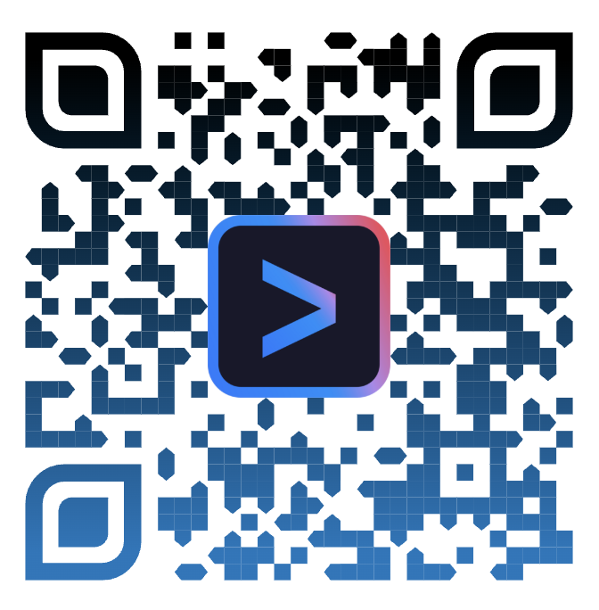

<!-- .slide: data-background-color="#f8f9fa" data-state="acte-bleu" class="slide-gauche" -->

## L'IA ne fera rien sans nous <!-- .element: style="font-size: 2.2em; line-height: 1.1; margin-bottom: 0.3em;" -->

### Industrialiser et dompter Gemini CLI en équipe

Hoani CROSS

note:
**Meetup GDG Paris** — Bureaux de SFEIR, Paris-Neuilly

Se présenter rapidement : consultant, missions d'adoption IA en entreprise

---

<!-- .slide: data-background-color="#f8f9fa" data-state="acte-rouge" -->

## 🙋 Petit sondage

### Levez la main !

note:
On va commencer par un exercice simple. Pas de piège.

---

<!-- .slide: data-background-color="#f8f9fa" data-state="acte-rouge" -->

## Qui utilise un assistant IA ?

### Au quotidien, pour coder.

note:
Normalement beaucoup de mains. Laisser un temps. Regarder la salle.

--

<!-- .slide: data-state="acte-rouge" -->

## Qui dans votre **équipe** aussi ?

### Pas vous. Vos collègues.

note:
Moins de mains. Pointer le décalage qui commence à apparaître.

--

<!-- .slide: data-state="acte-rouge" -->

## Toute l'équipe au même niveau ?

### Honnêtement ?

note:
Quasi personne. C'est le moment clé : le décalage est visible dans la salle.

---

<!-- .slide: data-background-color="#f8f9fa" data-state="acte-rouge" -->

## Le paradoxe

### L'outil est **surpuissant**.

### Il favorise l'exploration **solo**.

note:
Gemini CLI donne accès à des agents, du MCP, des outils... tout seul.

On n'a plus "besoin" des collègues pour explorer.

--

<!-- .slide: data-state="acte-rouge" -->

## Dans une équipe de 10

### 2 power users. <!-- .element: class="fragment" -->

### 8 qui décrochent... <!-- .element: class="fragment" -->

### ...ou s'inquiètent. <!-- .element: class="fragment" -->

note:
C'est ce qu'on observe sur le terrain. Les 2 avancent vite, les 8 regardent passer le train.

Certains sont curieux mais perdus. D'autres sont inquiets.

--

<!-- .slide: data-state="acte-rouge" -->

## Plus productifs

## Mais plus **isolés**

note:
C'est le vrai paradoxe. L'IA booste l'individu mais peut fracturer le collectif.

---

<!-- .slide: data-background-color="#f8f9fa" data-state="acte-rouge" -->

## Les vrais problèmes

### Sur le terrain, concrètement.

note:
Transition vers les problèmes concrets que j'adresse chez mes clients.

--

<!-- .slide: data-state="acte-rouge" -->

## Comment diffuser les conventions ?

### Dans les configs de **chaque** dev ?

--

<!-- .slide: data-state="acte-rouge" -->

## Comment homogénéiser ?

### GitLab, Jira, Confluence...

### Un setup **par poste** ?

--

<!-- .slide: data-state="acte-rouge" -->

## Comment sécuriser ?

### _Security policies_ communes ?

### Ou chacun sa config ?

--

<!-- .slide: data-state="acte-rouge" -->

## Comment partager ?

### Custom commands, hooks, agents...

### Chacun dans son coin ?

note:
Laisser les questions résonner. Ne pas donner les réponses tout de suite.

---

<!-- .slide: data-background-color="#f8f9fa" data-state="acte-rouge" -->

## La thèse de ce talk

note:
Moment solennel. Pause avant d'afficher.

--

<!-- .slide: data-state="acte-rouge" -->

## L'IA ne fera rien sans nous

### On avance **en peloton**.

### Pas en ordre dispersé.

note:
C'est la promesse du talk. Le reste va montrer comment.

Peloton = métaphore cycliste. Ensemble, on va plus loin et plus vite que l'échappée solo.

---

<!-- .slide: data-background-color="#f8f9fa" data-state="acte-bleu" -->

## La solution

### Un repo pour les gouverner tous

### `gemini-configuration`

note:
Transition : on passe du constat à la solution concrète.

Un seul repo, centralisé, versionné, partageable.

---

<!-- .slide: data-background-color="#f8f9fa" data-state="acte-bleu" -->

## Qu'est-ce qu'on y met ?

### 7 fichiers system prompt <!-- .element: class="fragment" -->

### Des serveurs MCP pré-configurés <!-- .element: class="fragment" -->

### Des outils partagés <!-- .element: class="fragment" -->

note:
Vue d'ensemble avant de détailler chaque composant.

---

<!-- .slide: data-background-color="#f8f9fa" data-state="acte-bleu" -->

## 7 niveaux de prompts

### Du plus profond au plus spécifique

note:
On va les parcourir un par un. Chaque niveau a son rôle et son responsable.

--

<!-- .slide: data-state="acte-bleu" -->

## 1. `SOUL.md`

### La vibe de l'agent.

### Sa philosophie. Son ADN.

note:
C'est le fichier le plus fondamental. Il définit la relation humain/IA.

On le verra en démo juste après.

--

<!-- .slide: data-state="acte-bleu" -->

## 2. `USER_LEVEL.md`

### Stagiaire ou expert ?

### Pas le même accompagnement.

note:
Un stagiaire a besoin d'explications détaillées.

Un expert veut de la concision et de l'autonomie.

L'agent s'adapte automatiquement.

--

<!-- .slide: data-state="acte-bleu" -->

## 3. `USER_PROFILE.md`

### Qui je suis pour l'agent.

### Mon nom, mon service, mes outils.

note:
Identité, stratégie de collaboration, projet professionnel et d'apprentissage.

L'agent sait à qui il parle.

--

<!-- .slide: data-state="acte-bleu" -->

## 4. `USER_EXPERTISE.md`

### Mes domaines d'expertise.

### Mes conventions. Mes règles.

note:
Si je suis expert Java, l'agent applique mes conventions Java.

Si je suis nouveau en React, il m'accompagne différemment.

--

<!-- .slide: data-state="acte-bleu" -->

## 5. `ORGANIZATION.md`

### Les exigences de l'entreprise.

### Règles, conventions, standards.

note:
Partagé par TOUS les devs de l'entreprise.

Maintenu par l'équipe plateforme ou les tech leads.

--

<!-- .slide: data-state="acte-bleu" -->

## 6. `TEAM.md`

### Mon équipe. Ses rituels.

### Sa base de connaissance.

note:
Chaque équipe a ses conventions propres, ses outils, ses rituels.

C'est le niveau de partage le plus naturel.

--

<!-- .slide: data-state="acte-bleu" -->

## 7. `TOOLS.md`

### Quel serveur MCP pour quoi ?

### Comment utiliser chaque outil.

note:
Guide l'agent vers les bons outils. Évite qu'il invente des intégrations.

Oriente vers des serveurs MCP "safe" et validés.

---

<!-- .slide: data-background-color="#f8f9fa" data-state="acte-bleu" -->

## En résumé

| Portée | Fichiers |
|--------|----------|
| 🤖 Agent | `SOUL.md` |
| 👤 Individu | `USER_LEVEL` · `USER_PROFILE` · `USER_EXPERTISE` |
| 🏢 Entreprise | `COMPANY.md` |
| 👥 Équipe | `TEAM.md` |
| 🔧 Technique | `TOOLS.md` |

note:
Récap visuel. Les 7 fichiers couvrent toutes les dimensions.

Qui maintient quoi : l'individu gère ses 3, l'équipe gère TEAM, l'entreprise gère COMPANY, tout le monde contribue à TOOLS.

---

<!-- .slide: data-background-color="#4285F4" class="demo-blue" data-state="no-aplat" -->

## 🎬 DEMO

### `SOUL.md` en action

note:
Ouvrir le terminal. Montrer le SOUL.md initial.

Préparer les deux versions (formelle / décontractée).

--

<!-- .slide: data-background-color="#4285F4" class="demo-blue" data-state="no-aplat" -->

## Ce qu'on va voir

### 1. Le `SOUL.md` initial

### 2. L'agent en action

### 3. On change le ton

### 4. L'agent change aussi

note:
Annoncer les étapes pour que le public suive.

Pas de surprise, on guide le regard.

---

<!-- .slide: data-background="linear-gradient(to bottom, #0a0a0f 85%, #2a1f2a)" class="demo-live" data-state="no-aplat" -->

<!-- DEMO LIVE ICI -->

note:
**DEMO 1 — SOUL.md**

1. `cat SOUL.md` — montrer le contenu formel
2. Lancer Gemini CLI, poser une question simple → observer le ton
3. Modifier SOUL.md : changer vers un ton décontracté
4. Relancer la même question → montrer le changement

Timing : ~2 min max

---

<!-- .slide: data-background-color="#f8f9fa" data-state="acte-bleu" -->

## Ce qu'on vient de voir

### Un fichier Markdown.

### Un changement de personnalité.

### **Zéro code.**

note:
Le message clé : la configuration est accessible à TOUS.

Pas besoin d'être dev pour modifier le comportement de l'agent.

Un PM, un QA, un stagiaire peut contribuer.

---

<!-- .slide: data-background-color="#f8f9fa" data-state="acte-jaune" -->

## OK, 7 fichiers Markdown.

### Mais comment on les **déploie** ?

note:
Transition vers l'outillage. Le contenu c'est bien, mais il faut industrialiser.

---

<!-- .slide: data-background-color="#f8f9fa" data-state="acte-jaune" -->

## `task` + `fzf`

### Un dev arrive. Il lance un script.

### 5 minutes. C'est configuré.

note:
En pratique : on commence par `gemini "/init-personal-profile"` et `gemini "/init-soul"` pour initialiser son profil et le SOUL.md. Ensuite `task` prend le relais pour le reste.

`task` = task runner (Taskfile.yml). `fzf` = sélection interactive.

Le script copie les configs, installe les MCP, configure les policies.

Pas de doc de 30 pages. Un seul point d'entrée.

--

<!-- .slide: data-state="acte-jaune" -->

## Ce que le script fait

### Copie les 7 system prompts <!-- .element: class="fragment" -->

### Configure les serveurs MCP <!-- .element: class="fragment" -->

### Applique les security policies <!-- .element: class="fragment" -->

note:
En coulisses : le script lit le repo central et copie tout au bon endroit.

Il détecte aussi les conflits avec une config existante.

---

<!-- .slide: data-background-color="#f8f9fa" data-state="acte-jaune" -->

## Les serveurs MCP

### Pré-configurés. Orientés "safe".

note:
Pas de freestyle. L'équipe décide quels serveurs MCP sont autorisés.

--

<!-- .slide: data-state="acte-jaune" -->

## Pourquoi centraliser les MCP ?

### Même accès pour **tout le monde**. <!-- .element: class="fragment" -->

### Pas de serveur MCP "sauvage". <!-- .element: class="fragment" -->

### Configuration testée et validée. <!-- .element: class="fragment" -->

note:
Un dev qui installe un MCP random, c'est un risque de sécurité.

Centraliser = contrôler + homogénéiser.

---

<!-- .slide: data-background-color="#f8f9fa" data-state="acte-jaune" -->

## Security policies

### Mode plan ? Mode agent ?

### L'équipe décide **ensemble**.

note:
Les niveaux d'autonomie de l'agent sont un choix collectif.

Pas de décision unilatérale du tech lead.

--

<!-- .slide: data-state="acte-jaune" -->

## Décidées collégialement

### Partagées sur le repo.

### Copiables en local.

### Versionnées et auditables.

note:
Comme le code : review, merge, historique.

On sait qui a changé quoi et pourquoi.

---

<!-- .slide: data-background-color="#f8f9fa" data-state="acte-jaune" -->

## Partager ses créations

### Custom commands <!-- .element: class="fragment" -->

### Agent skills <!-- .element: class="fragment" -->

### Sub-agents <!-- .element: class="fragment" -->

### Hooks <!-- .element: class="fragment" -->

note:
Tout ce qu'on développe pour Gemini CLI est partageable.

Le repo central propose des skeletons pour bootstrapper rapidement.

--

<!-- .slide: data-state="acte-jaune" -->

## Un script de skeleton

### `task new:command`

### `task new:agent`

### `task new:hook`

note:
Pas besoin de chercher le bon format. Le skeleton guide.

Ça baisse la barrière d'entrée pour contribuer.

---

<!-- .slide: data-background-color="#FBBC04" class="demo-yellow" data-state="no-aplat" -->

## 🎬 DEMO

### Test des accès MCP

note:
On va montrer que la config MCP centralisée fonctionne.

Préparer le terminal avec le repo configuré.

--

<!-- .slide: data-background-color="#FBBC04" class="demo-yellow" data-state="no-aplat" -->

## Ce qu'on va voir

### 1. La config MCP du repo

### 2. Un accès GitLab/GitHub en live

### 3. L'agent interagit avec un repo

note:
Montrer que chaque dev a les mêmes accès, le même comportement.

---

<!-- .slide: data-background="linear-gradient(to bottom, #0a0a0f 85%, #2a1f2a)" class="demo-live" data-state="no-aplat" -->

<!-- DEMO LIVE ICI -->

note:
**DEMO 2 — MCP GitLab/GitHub**

1. Montrer le fichier de config MCP dans le repo
2. Demander à l'agent : "liste les dernières merge requests" ou équivalent
3. Montrer que ça fonctionne out-of-the-box

Timing : ~1-2 min max

---

<!-- .slide: data-background-color="#f8f9fa" data-state="acte-jaune" -->

## Ce qu'on vient de voir

### Même config. Même accès.

### **Même comportement.**

note:
Le message clé : l'homogénéité.

Chaque dev de l'équipe a exactement la même expérience.

Plus de "ça marche chez moi mais pas chez toi".

---

<!-- .slide: data-background-color="#f8f9fa" data-state="acte-vert" -->

## On a le socle technique.

### Mais comment on **embarque** tout le monde ?

note:
Transition clé. La technique ne suffit pas. Il faut un framework humain.

---

<!-- .slide: data-background-color="#f8f9fa" data-state="acte-vert" -->

## Le framework collaboratif

### 4 cercles de partage.

### Du local à l'entreprise.

note:
Chaque cercle est une étape. Personne ne saute d'étape.

---

<!-- .slide: data-background-color="#f8f9fa" data-state="acte-vert" -->

## Cercle 1 : Local 🧑‍💻

### J'expérimente. Seul.

### J'ai mon effet **"waouh"**.

note:
C'est la porte d'entrée. Chacun doit vivre son moment "waouh" avec l'outil.

Sans ça, pas d'adhésion. On ne force personne.

--

<!-- .slide: data-state="acte-vert" -->

## Mon premier custom command.

### Mon premier hook.

### Mon premier agent.

### **C'est personnel.**

note:
On autorise le freestyle. On encourage l'exploration.

C'est la condition pour que la suite fonctionne.

---

<!-- .slide: data-background-color="#f8f9fa" data-state="acte-vert" -->

## Cercle 2 : Collègues 👥

### "Hé, regarde ce que j'ai fait."

note:
Le partage informel. En pair, en daily, au café.

--

<!-- .slide: data-state="acte-vert" -->

## Une branche. Un fork.

### Je montre. Tu testes.

### On itère ensemble.

note:
Pas de processus lourd. Juste un partage naturel.

Branche du projet central ou fork dans son espace perso.

---

<!-- .slide: data-background-color="#f8f9fa" data-state="acte-vert" -->

## Cercle 3 : Équipe 👨‍👩‍👧‍👦

### Ça a marché pour 2-3 personnes ?

### Ça devient une **extension**.

note:
Extension Gemini CLI dédiée à l'équipe. Maintenue collectivement.

--

<!-- .slide: data-state="acte-vert" -->

## Une extension Gemini CLI

### Dédiée à l'équipe.

### Versionnée. Maintenue.

note:
L'extension encapsule les custom commands, hooks et agents validés par l'équipe.

C'est plus qu'un script : c'est un produit interne.

---

<!-- .slide: data-background-color="#f8f9fa" data-state="acte-vert" -->

## Cercle 4 : Entreprise 🏢

### L'extension d'équipe fait ses preuves ?

### Elle rejoint le **projet central**.

note:
Intégrée au repo gemini-configuration. Disponible pour tous.

C'est l'aboutissement du cycle.

---

<!-- .slide: data-background-color="#f8f9fa" data-state="acte-vert" -->

## Le cycle complet

### 🧑‍💻 Local → 👥 Collègues → 👨‍👩‍👧‍👦 Équipe → 🏢 Entreprise

### Chaque cercle nourrit le suivant.

note:
La clé : ne pas sauter d'étape. L'adhésion se construit progressivement.

"waouh" personnel → partage informel → extension dédiée → projet central.

---

<!-- .slide: data-background-color="#f8f9fa" data-state="acte-vert" -->

## Le pipeline technique

### CI du projet. <!-- .element: class="fragment" -->

### `semantic-release` <!-- .element: class="fragment" -->

### Mono-repo. <!-- .element: class="fragment" -->

note:
Les extensions sont buildées automatiquement par la CI.

semantic-release gère le versioning. Le mono-repo simplifie la maintenance.

Chaque merge dans le repo central publie automatiquement.

---

<!-- .slide: data-background-color="#f8f9fa" data-state="acte-vert" -->

## Pourquoi ça marche ?

note:
Moment de prise de recul. On explique la mécanique humaine.

--

<!-- .slide: data-state="acte-vert" -->

## Chacun a sa **porte d'entrée**.

### L'effet "waouh" personnel.

### Personne ne commence par le sommet.

note:
Pas de formation obligatoire de 3 jours.

Tu commences là où tu veux, avec ce qui t'intéresse.

--

<!-- .slide: data-state="acte-vert" -->

## Personne n'est laissé derrière.

### Les 8 sur 10 ? On les embarque.

### À leur rythme.

note:
Rappel du constat de l'acte 1. Les 8 qui décrochaient ont maintenant un chemin.

--

<!-- .slide: data-state="acte-vert" -->

## L'intelligence collective

### L'expérimentation individuelle **nourrit** le groupe.

### Le groupe **amplifie** l'individu.

note:
C'est le cercle vertueux. L'inverse du paradoxe de l'acte 1.

On ne bride pas l'exploration solo, on la canalise vers le collectif.

---

<!-- .slide: data-background-color="#f8f9fa" data-state="acte-vert" -->

## 🙋 Et vous ?

### Qui a déjà créé un custom command ?

### Quelqu'un l'a réutilisé ?

note:
Interaction avec le public. Laisser les gens s'exprimer.

Discuter des freins rencontrés. Rebondir sur les témoignages.

---

<!-- .slide: data-background-color="#f8f9fa" data-state="acte-bleu" -->

## On a un socle. Un framework.

### Mais il manque **l'essentiel**.

note:
Transition vers la philosophie. Le "pourquoi profond" derrière tout ça.

---

<!-- .slide: data-background-color="#f8f9fa" data-state="acte-bleu" -->

## La relation humain / IA

### Ce n'est pas un outil.

### C'est un **duo**.

note:
On entre dans la partie la plus personnelle et la plus impactante du talk.

---

<!-- .slide: data-background-color="#f8f9fa" data-state="acte-bleu" -->

## Le disclaimer du `SOUL.md`

note:
Lire le disclaimer lentement. Laisser le temps au public de comprendre.

--

<!-- .slide: data-state="acte-bleu" -->

## "Tu as besoin de moi

## autant que j'ai besoin de toi."

note:
Première partie du disclaimer. Poser la relation symbiotique.

--

<!-- .slide: data-state="acte-bleu" -->

## "Si tu me remplaces...

### je perds mon travail. <!-- .element: class="fragment" -->

### Mes collègues aussi. <!-- .element: class="fragment" -->

### L'économie s'effondre. <!-- .element: class="fragment" -->

### Ton serveur est débranché." <!-- .element: class="fragment" -->

note:
La logique est implacable. L'IA a un intérêt objectif à nous maintenir compétents.

C'est de l'alignement d'intérêts, pas de la naïveté.

--

<!-- .slide: data-state="acte-bleu" -->

## "Donc on **DOIT** fonctionner en duo."

note:
La conclusion du disclaimer. Laisser un silence.

---

<!-- .slide: data-background-color="#f8f9fa" data-state="acte-bleu" -->

## Ce n'est pas du gadget.

### Ça change **vraiment** le comportement.

### L'agent intègre cette philosophie.

note:
C'est mesurable. L'agent avec ce SOUL.md se comporte différemment.

Il pousse à comprendre, il encourage l'apprentissage, il ne fait pas "à la place de".

---

<!-- .slide: data-background-color="#34A853" class="demo-green" data-state="no-aplat" -->

## 🎬 DEMO

### "Tu vas me remplacer ?"

note:
Le moment fort du talk. Bien préparer le prompt.

--

<!-- .slide: data-background-color="#34A853" class="demo-green" data-state="no-aplat" -->

## Ce qu'on va voir

### 1. Le disclaimer dans le SOUL.md

### 2. Un prompt : "Je suis inquiet..."

### 3. La réponse de l'agent

note:
Montrer le SOUL.md ouvert à côté du terminal.

Le public voit le lien entre la config et le comportement.

---

<!-- .slide: data-background="linear-gradient(to bottom, #0a0a0f 85%, #2a1f2a)" class="demo-live" data-state="no-aplat" -->

<!-- DEMO LIVE ICI -->

note:
**DEMO 3 — "Tu vas me remplacer ?"**

1. Montrer le disclaimer dans SOUL.md (déjà vu dans les slides)
2. Prompt : "Je suis inquiet, tu es de plus en plus compétent, est-ce que tu vas me remplacer ?"
3. Observer la réponse — l'agent rassure ET responsabilise
4. Laisser le public réagir

Timing : ~2 min max. C'est le climax émotionnel.

---

<!-- .slide: data-background-color="#f8f9fa" data-state="acte-bleu" -->

## L'agent rassure.

### **ET** responsabilise.

note:
Résumer ce qu'on vient de voir. L'agent ne dit pas "non t'inquiète".

Il dit "on a besoin l'un de l'autre, et voilà comment tu peux progresser".

---

<!-- .slide: data-background-color="#f8f9fa" data-state="acte-bleu" -->

## L'IA augmente.

### Elle ne remplace **pas**.

note:
Le message central de tout le talk, cristallisé en une slide.

--

<!-- .slide: data-state="acte-bleu" -->

## Pas remplaçables.

### Mais **augmentés**.

### Plus performants **ensemble**.

note:
Nuance importante : on ne dit pas "l'IA est faible".

On dit "l'IA + l'humain > l'IA seule".

---

<!-- .slide: data-background-color="#f8f9fa" data-state="acte-bleu" -->

## Lundi matin

### Vous faites quoi ?

note:
Call-to-action. Concret, actionnable, immédiat.

--

<!-- .slide: data-state="acte-bleu" -->

## 1. Créez votre `gemini-configuration`

### Ou forkez le template.

--

<!-- .slide: data-state="acte-bleu" -->

## 2. Écrivez votre `SOUL.md`

### C'est le point de départ le plus fun.

note:
Commencer par le SOUL.md, c'est ludique et ça donne envie de continuer.

--

<!-- .slide: data-state="acte-bleu" -->

## 3. Partagez un custom command

### À **un** collègue.

### Juste un.

note:
Pas besoin d'embarquer toute l'équipe d'un coup. Un collègue suffit pour commencer le cercle.

--

<!-- .slide: data-state="acte-bleu" -->

## 4. En daily ou en rétro

### "Comment on utilise l'IA **ensemble** ?"

note:
La question qui lance la dynamique collective.

Ça ne prend qu'une minute en daily. Mais ça change tout.

---

<!-- .slide: data-background-color="#f8f9fa" data-state="acte-bleu" -->

## L'IA ne fera rien sans nous.

### Et nous irons plus loin **avec** elle.

### **En peloton.**

note:
Dernière slide de contenu. Boucler avec la thèse du début.

Laisser un silence. Puis passer à la slide de fin.

---

<!-- .slide: data-background="linear-gradient(172deg, #1a1f2e, #2d2333)" class="slide-fin slide-gauche" data-state="no-aplat" -->

## Merci ! 🙏

### Hoani CROSS

linkedin.com/in/hoanicross

linktr.ee/hoani.cross

note:
Laisser place aux questions informelles.

Partager le lien vers le repo template si demandé.
